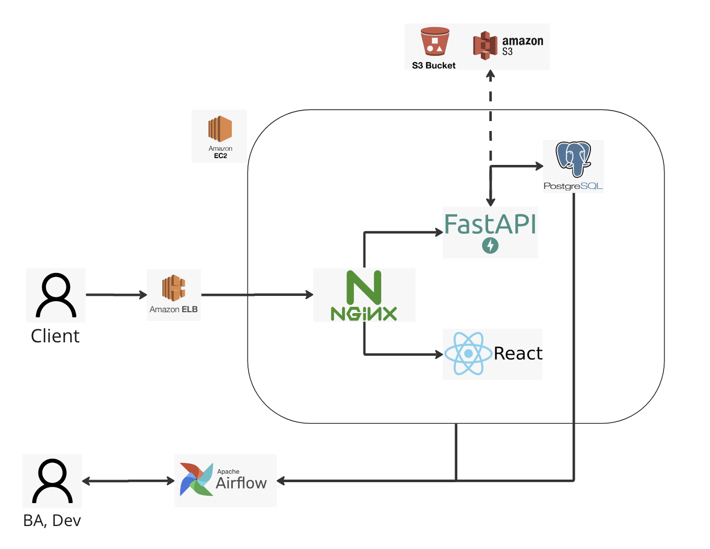
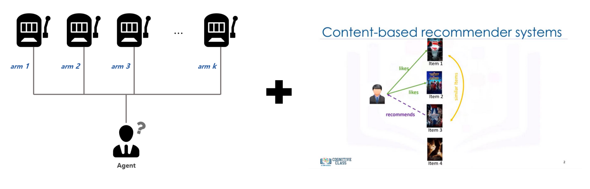
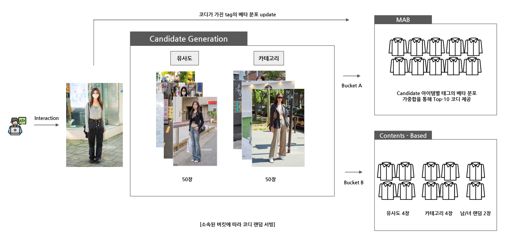
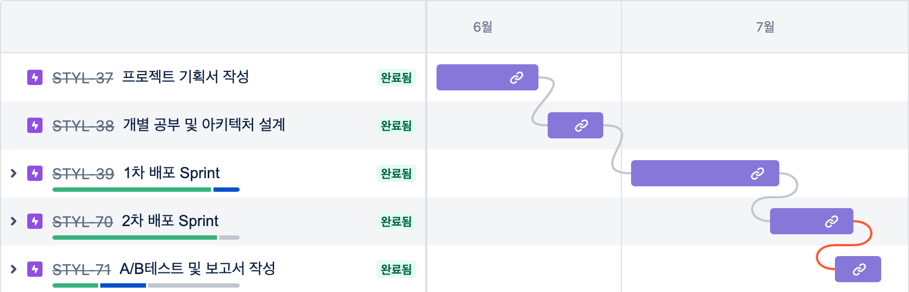

  

 
  
  
<strong>Skills</strong>
     

---
 

    
    
    
    
    
     
    
    
    
    

  
  

<!-- TABLE OF CONTENTS -->

  
Table of Contents

  <ol>
    <li><a href="#프로젝트-개요">프로젝트 개요</a></li>
    <li><a href="#시연-영상">시연 영상</a></li>
    <li><a href="#아키텍처">아키텍처</a></li>
    <li><a href="#추천-로직">추천 로직</a></li>
    <li><a href="#프로젝트-구조">프로젝트 구조</a></li>
    <li><a href="#타임라인">로드맵</a></li>
  </ol>

 

<!-- 프로젝트 개요 -->
## 프로젝트 개요

### 문제 정의

 

(<a href="#readme-top">back to top</a>)

## 시연 영상

 

(<a href="#readme-top">back to top</a>)

## 아키텍처

 

### 데이터

### 프론트

### 백

(<a href="#readme-top">back to top</a>)

## 추천 로직

 

(<a href="#readme-top">back to top</a>)

## 유저 로그 분석

(<a href="#readme-top">back to top</a>)

## 프로젝트 구조

    📦STYL
    ┣ 📂client
    ┣ 📂docs
    ┣ 📂logging
    ┣ 📂scripts
    ┣ 📂src
    ┃ ┣ 📂router
    ┃ ┗ 📜backend
    ┣ 📜Dockerfile
    ┣ 📜nginx.conf
    ┗ 📜README.md

- [styl-frontend](https://github.com/Lv2-Recsys-01/styl-frontend)

- [styl-backend](/docs/README.md)

- [styl-ml](https://github.com/Lv2-Recsys-01/styl-ml)

- [styl-airflow](https://github.com/Lv2-Recsys-01/styl-airflow)

(<a href="#readme-top">back to top</a>)

## 타임라인

(<a href="#readme-top">back to top</a>)

## 팀원소개
   
  :sunglasses:곽동호 T5013 :moneybag:권수훈 T5017 :smile_cat:박상우 T5081
    
  :smile:이민호 T5140 :stuck_out_tongue_winking_eye:이한정 T5166 :relaxed:이준원 T5237
   

(<a href="#readme-top">back to top</a>)

 