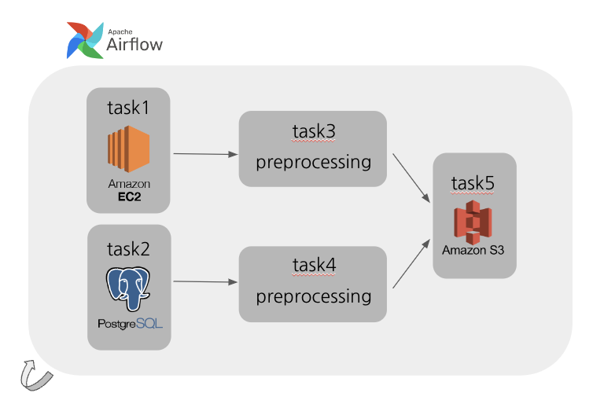
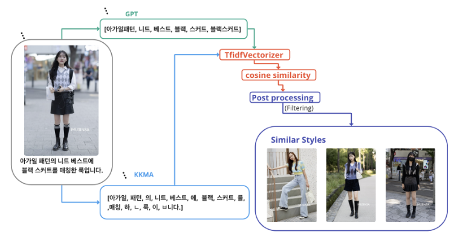
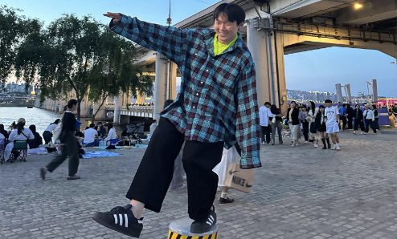
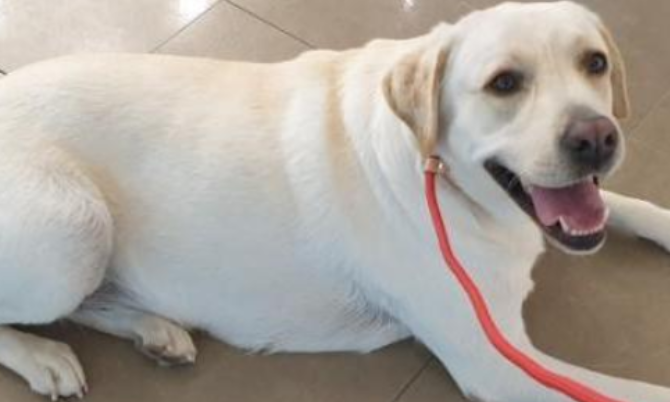
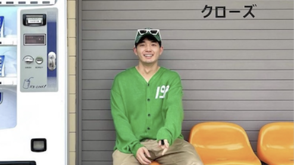
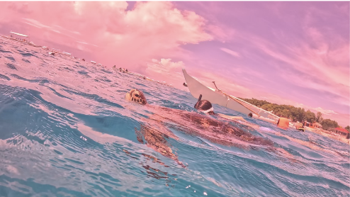

  

  
<strong>Skills</strong>
     

---

 

    
    
    
    
    
     
    
    
    
    

  

<!-- TABLE OF CONTENTS -->

  
Table of Contents

  <ol>
    <li><a href="#프로젝트-개요">프로젝트 개요</a></li>
    <li><a href="#시연-영상">시연 영상</a></li>
    <li><a href="#아키텍처">아키텍처</a></li>
    <li><a href="#추천-로직">추천 로직</a></li>
    <li><a href="#프로젝트-구조">프로젝트 구조</a></li>
    <li><a href="#랩업-리포트-및-발표-영상">랩업 리포트 및 발표 영상</a></li>
    <li><a href="#팀원소개">팀원소개</a></li>
  </ol>

 

<!-- 프로젝트 개요 -->

## 프로젝트 개요

‘Journey’는 수많은 사진 속에서 자신만의 패션을 찾아가는 AI 코디 추천 서비스입니다.

[서비스 링크](https://stylesjourney.com) (23년 8월 중순까지 서비스 운영 예정입니다.)
 

(<a href="#readme-top">back to top</a>)

## 시연 영상

 

(<a href="#readme-top">back to top</a>)

## 아키텍처

### Front End

-   React

### Back End

-   FastAPI

### Data

**ERD**

 

-   무신사 스트릿 스냅 이미지 크롤링
-   선정 이유: 다양한 메타 데이터, 다양한 스타일, 비상업성, 무보정, 비슷한 구도

 

**Airflow Pipeline**

(<a href="#readme-top">back to top</a>)

## 추천 로직

### 유사한 코디 추천 (Journey)

### 개인화 코디 추천 (Similar Style)

 

**1. MAB**

 

**2. Contents based**

(<a href="#readme-top">back to top</a>)

## 프로젝트 구조

    📦STYL
    ┣ 📂client
    ┣ 📂docs
    ┣ 📂logging
    ┣ 📂scripts
    ┣ 📂src
    ┃ ┣ 📂router
    ┃ ┗ 📜backend
    ┣ 📜Dockerfile
    ┣ 📜nginx.conf
    ┗ 📜README.md

총 4개의 repo를 만들어 작업하였고 backend repo에 통합하여 서비스를 배포하였습니다.

docker를 사용하여 로컬에서 실제 서비스와 같은 환경을 구축하여 개발을 진행했습니다.

-   [styl-frontend](https://github.com/Lv2-Recsys-01/styl-frontend)

-   [styl-backend](/docs/README.md)

-   [styl-ml](https://github.com/Lv2-Recsys-01/styl-ml)

-   [styl-airflow](https://github.com/Lv2-Recsys-01/styl-airflow)

(<a href="#readme-top">back to top</a>)

## 랩업 리포트 및 발표 영상
[랩업 리포트](./docs/wrapup.pdf)
[발표 영상](https://www.youtube.com/watch?v=M98BRk6CqNE&t=152s)

(<a href="#readme-top">back to top</a>)

## 팀원소개

<table><tbody><tr>
<td align="center">
    
    
<a href="https://github.com/CIOI">곽동호</a>

    
Data Engineering, Modeling

</td>
<td align="center">
        
        
<a href="https://github.com/DarrenKwonDev">권수훈</a>

        
PM, BE, FE, Ops

    </td>
<td align="center">
        
        
<a href="https://github.com/sangwu99">박상우</a>

        
BE, Modeling

    </td>
</tr>
<tr>
<td align="center">
        
        
<a href="https://github.com/RonaldFisher9999">이민호</a>

        
Data Engineering, BE, Modeling, AB Test

    </td>
<td align="center">
        
        
<a href="https://github.com/junwon-0313">이준원</a>

        
FE, BA, Modeling

    </td>
<td align="center">
        
        
<a href="https://github.com/leehanjeong">이한정</a>

        
Data Engineering, BE, Ops

    </td>
</tr>
</tbody></table>
 

(<a href="#readme-top">back to top</a>)

 
